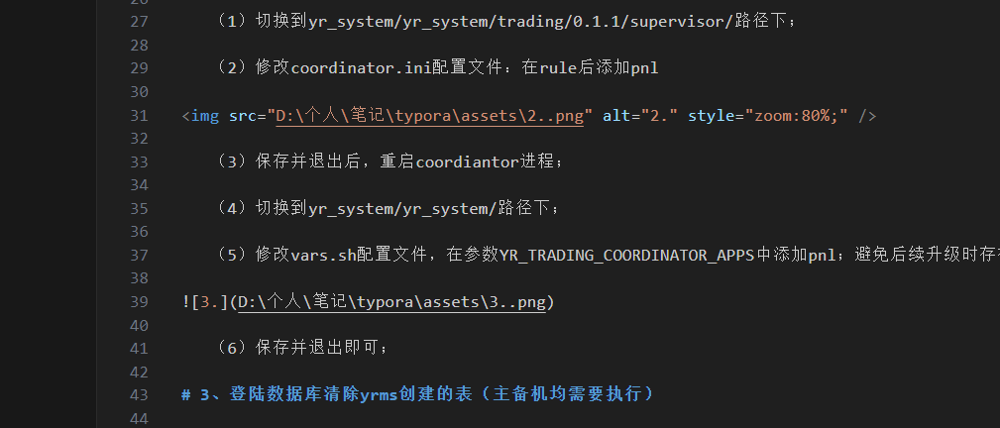

# 002-实盘环境变更

# 1、更新gateway模块补丁包

补丁包名称：【libshennong_gateway_a5.so】

替换路径：yr_system/yr_system/gateway/0.1.1/A5/lib/ 

更新步骤：

​	（1）切换到yr_system/yr_system/gateway/0.1.1/A5/lib/路径下；

​	（2）将原有的so包进行备份；mv libshennong_gateway_a5.so libshennong_gateway_a5.so.bak

​	（3）将新的so包上传到该路径下，修改或确认so包的权限信息等；

​	（4）重启A5进程即可；

更新结果：

<<<<<<< HEAD
D:\个人\笔记\github\-\typora\assets\1..png

=======
typora/assets/1..png
>>>>>>> 2e55eae06b400519733cd46b2345fbb3fe556944
# 2、在coordinator中添加pnl配置

更新步骤：

​	（1）切换到yr_system/yr_system/trading/0.1.1/supervisor/路径下；

​	（2）修改coordinator.ini配置文件：在rule后添加pnl


​	（3）保存并退出后，重启coordiantor进程；

​	（4）切换到yr_system/yr_system/路径下；

​	（5）修改vars.sh配置文件，在参数YR_TRADING_COORDINATOR_APPS中添加pnl；避免后续升级时存在遗漏；


​	（6）保存并退出即可；

# 3、登陆数据库清除yrms创建的表（主备机均需要执行）

更新步骤：

​	（1）登陆到yueran数据库中，show tables;查看已有的表

​	（2）jobsLog yrStrategyLog  yrAccountLog  yrStrategy  yrAccount 将这五张表删除；

```sql
drop table jobsLog;
drop table yrStrategyLog;
drop table yrAccountLog;
drop table yrStrategy;
drop table yrAccount;
```

​	（3）重启pnl进程；

​	（4）再次登录数据库查看以上五张表是否重新创建；

# 4、配置数据库主从同步

参考在线文档：https://docs.qq.com/doc/DSUtTSEJ6SlB4TVlE

> 注：数据库主从配置已在麒麟服务器验证通过；
